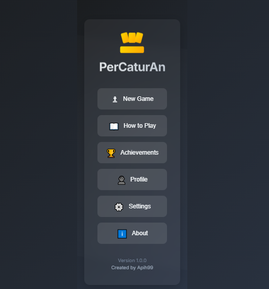
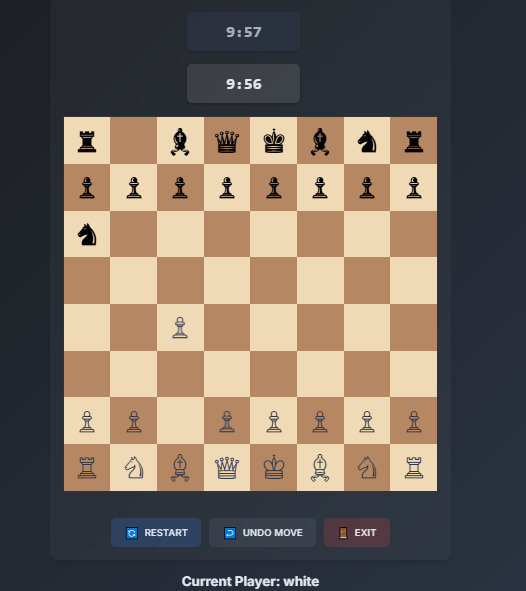

# ♟️ Chess Game

A modern chess game built with React, featuring multiple game modes, customizable themes, and an intuitive interface. Actually I was bored so i created this game.




## 🚀 Requirements

- Node.js (v14.0.0 or higher)
- npm (v6.0.0 or higher)

## 📁 Project Structure

```tree
chess/
├── public/
│   ├── index.html
│   ├── favicon.ico
│   └── sounds/
│       ├── move.mp3
│       ├── capture.mp3
│       ├── check.mp3
│       ├── game-start.mp3
│       └── game-end.mp3
├── src/
│   ├── components/
│   │   ├── Timer.js
│   │   └── Achievements.js
│   ├── ai/
│   │   └── chessAI.js
│   ├── App.js
│   ├── App.css
│   ├── index.js
│   └── checkDetection.js
├── package.json
└── README.md
```

## ✨ Features

- 👥 Player vs Player and Player vs Computer modes
- 🤖 Multiple difficulty levels for AI
- 🎨 Customizable board themes
- ✅ Move validation and legal move highlighting
- ⚡ Check and checkmate detection
- ↩️ Move history and undo functionality
- ⏲️ Timer support for rapid games
- 🔊 Sound effects for moves
- 🏆 Achievements system
- 👤 Player profiles

## 🛠️ Installation

1. **Clone the repository:** 📥

```bash
git clone [repository-url]
cd chess
```

2. **Install dependencies:** 📦

```bash
npm install
```

3. **Start the development server:** 🚀

```bash
npm start
```

4. **Build for production:** 🏗️

```bash
npm run build
```

## 🔊 Sound Credits

Sound effects should be placed in the `public/sounds` directory:
- 🎵 move.mp3: Piece movement sound
- 💥 capture.mp3: Piece capture sound
- ⚠️ check.mp3: Check notification sound
- 🎮 game-start.mp3: Game start sound
- 🏁 game-end.mp3: Game end sound

## 🌐 Browser Support

- �Chrome Chrome (latest)
- 🦊 Firefox (latest)
- 🧭 Safari (latest)
- 📱 Edge (latest)

## 🤝 Contributing

1. Fork the repository 🍴
2. Create your feature branch (`git checkout -b feature/AmazingFeature`)
3. Commit your changes (`git commit -m 'Add some AmazingFeature'`)
4. Push to the branch (`git push origin feature/AmazingFeature`)
5. Open a Pull Request 📬

## 📄 License

This project is licensed under the MIT License - see the LICENSE file for details.

## 👨‍💻 Author

Apih99 - hafizcr716@gmail.com

## 🙏 Acknowledgments

- ♟️ Chess piece designs
- 🎵 Sound effects sources
- ⚛️ React community

## 🎮 Game Controls

- ↩️ Undo Move: Takes back the last move
- 🔄 Restart: Resets the game to initial position
- ⏸️ Pause: Pauses the game timer
- 🚪 Exit: Returns to main menu

## 🎯 Future Features

- 📱 Mobile responsive design
- 🌐 Online multiplayer
- 💾 Save/Load games
- 📊 Player statistics
- 🎓 Tutorial mode
- 🌙 Dark/Light theme toggle

## 💡 Tips

- Use keyboard shortcuts for faster gameplay
- Study the AI patterns to improve your game
- Practice different openings
- Keep an eye on the timer in rapid games
- Use the undo feature to learn from mistakes

## 🐛 Bug Reports

Found a bug? Please open an issue with the following information:
- Bug description
- Steps to reproduce
- Expected behavior
- Screenshots (if applicable)

## ⭐ Support

If you like this project, please give it a star! ⭐

## 📫 Contact

For any queries or suggestions, feel free to reach out:
- 📧 Email: hafizcr716@gmail.com
- 🐦 Twitter: [apihnine9]
